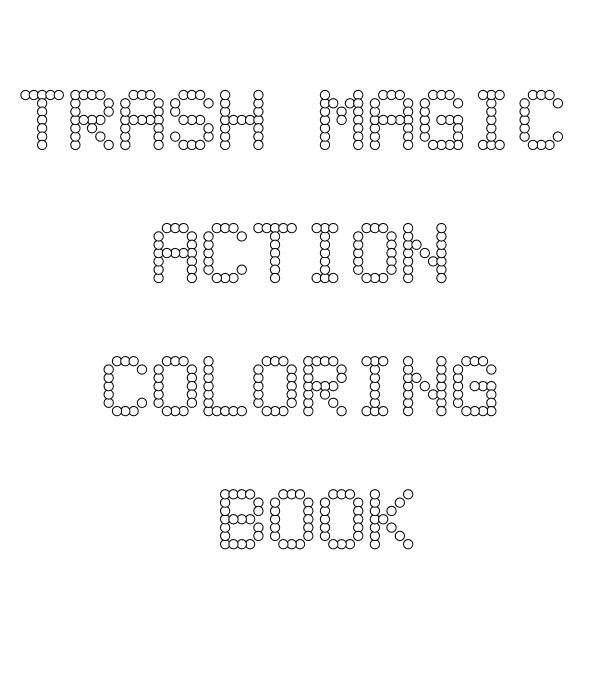
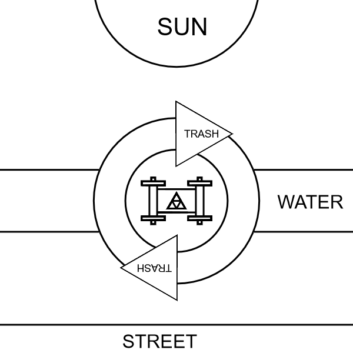
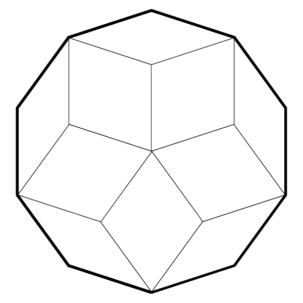
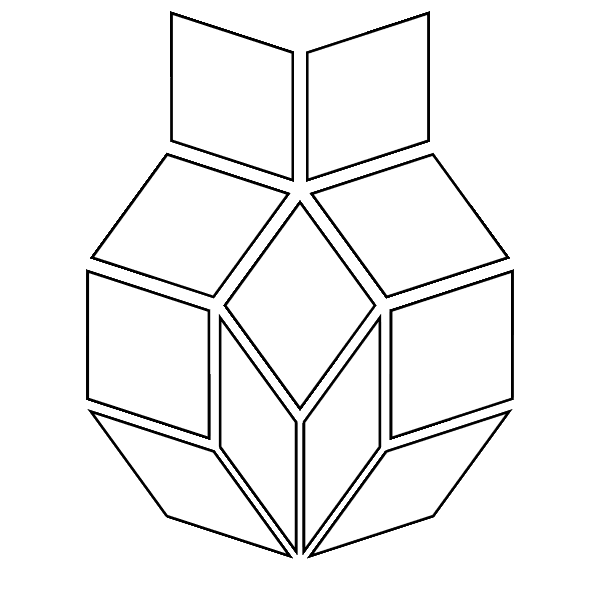
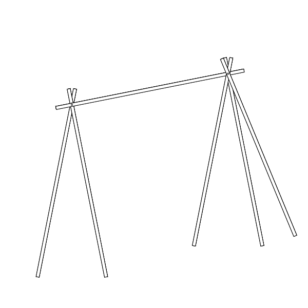

[home](scrolls/home)

# TRASH MAGIC ACTION COLORING BOOK

## TRASH ROBOT

[pdf for download](https://github.com/LafeLabs/trashmagic/raw/main/booklettersizebooklet.pdf)

## Create the book

Print that document two sided, be sure to flip on short edge rather than long edge if that is an option with your printer.

[print and fold and bind tiktok](https://www.tiktok.com/@trash_robot/video/7034551659426712879)

Stack all the pages in order, and fold in half so that the booklet is 8.5 inches by 5.5 inches, and so that the front cover is on the outside, which says the title of the book.

Draw dots every half inch, using your eyeball to judge how far in from the edge to make it. Exact dimensions don't matter, just make it about that distance and as even as you can.  

Punch holes on each dot with a thumb tack, with cardboard in the back of the booklet so the tack has somewhere to push into other than your leg.  

Either staple down the spine or stitch by hand using a needle and thread with a back stitch.  Tie knots at both ends of thread, cut off extra thread.  

You have now created another book!

## Page 1: Trash Robot

Now draw your first TRASH ROBOT.  See this example:

		

